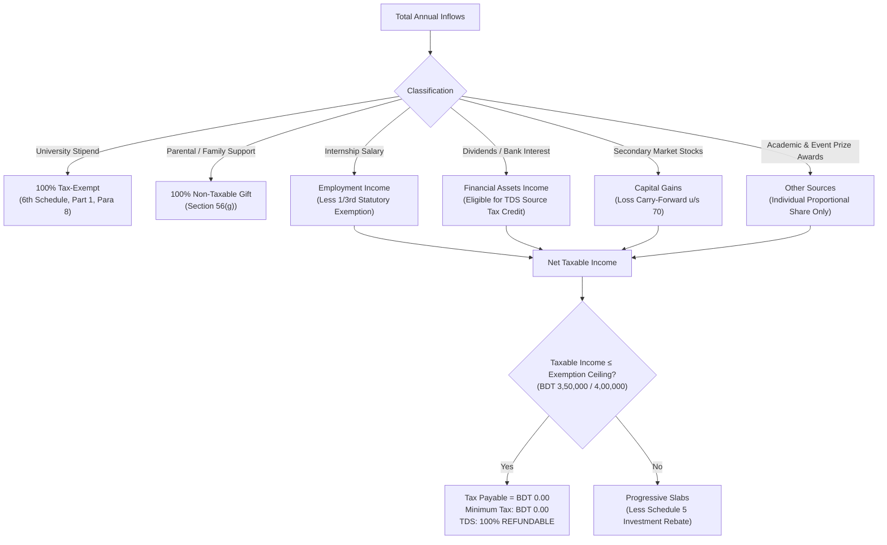

<div align="center">

# 🇧🇩 Bangladesh Youth Tax Calculator (`youth-tax-calculator`)
### An Intelligent Tax Planning & Filing Assistant for the NBR e-Return Portal (`etaxnbr.gov.bd`)
**Tailored for Students, Interns, Fresh Graduates & First-Time Employees**

[](https://nbr.gov.bd)
[](https://etaxnbr.gov.bd)
[](#installation)
[](LICENSE)

<p align="center">
  <b>Navigate complex tax laws • Minimize tax liability legally • Balance IT-10B to exact zero • Protect against audits</b>
</p>

---

</div>

## 📌 Why `youth-tax-calculator`?

Young taxpayers in Bangladesh face unique financial scenarios that standard corporate accountants and generic tax guides frequently mishandle. This assistant is specifically engineered to address:

* 🎓 **Academic Stipends & Scholarships:** Full tax exemption under the **Sixth Schedule, Part 1, Paragraph 8** by correctly activating the portal's hidden *Tax Exempted Income* schedule.
* 💼 **Internships & Contracted Traineeships:** Correct categorization under *Income from Employment* (Section 32) with automatic application of the statutory **$\frac{1}{3}$rd salary exemption** (capped at BDT 4,50,000).
* 🛡️ **High Bank Turnover Defense:** Robust, audit-ready balance sheet methods to account for high-volume bank deposits originating from shared student academic and student award prize pools, peer expense settlements, and family support transfers (**Section 56(g)**) with **zero tax liability**.
* 📉 **Multi-Broker Capital Loss Carry-Forward:** Correctly setting off and carrying forward capital losses across multiple brokerage accounts under **Section 70**, while clarifying the known system-generated math artifact on Page 9 vs. Page 10 of NBR's draft PDF.
* ⚖️ **Zero-Difference Balance Sheet Math (IT-10B & IT-10BB):** Automated balancing equations ensuring:
  $$\text{Total Fund Outflow} - \text{Total Source of Fund} \equiv \mathbf{0.00}$$
* 📖 **Official NBR User Manual Integration:** Pre-packaged with NBR's official 107-page *eReturn System User Manual* and the *Special Registration Guidelines* for overseas citizens.

---

## 🏛️ Statutory Highlights (Assessment Year 2026–2027)



### Key Thresholds & Rules
1. **Tax-Free Limits:** General taxpayers receive up to **BDT 3,50,000 – 4,00,000** completely tax-free (higher for female taxpayers, senior citizens, and specialized categories).
2. **The Minimum Tax Rule:** Minimum tax (BDT 5,000 / 4,000 / 3,000) **never triggers** if taxable income is at or below the tax-free limit.
3. **Refundable Source Tax:** Any Tax Deducted at Source (TDS) on bank interest or dividends is registered by the portal as **Refundable** when total tax liability is BDT 0.00.

---

## 🚀 Installation

Install globally into Antigravity across your system with one command.

### Automated 1-Click Install

<table>
<tr>
<th>Platform</th>
<th>Command</th>
</tr>
<tr>
<td><b>Windows (PowerShell)</b></td>
<td>

```powershell
.\install.ps1
```
</td>
</tr>
<tr>
<td><b>macOS / Linux (Bash)</b></td>
<td>

```bash
chmod +x install.sh && ./install.sh
```
</td>
</tr>
</table>

---

### Manual Global Installation

Copy the `skills/youth-tax-calculator` directory into your global Antigravity configuration directory:

* **Windows:**
  ```text
  C:\Users\<Your-Username>\.gemini\config\skills\youth-tax-calculator\
  ├── SKILL.md
  └── references\
      ├── UserManualEN.pdf
      └── Special_Registration.pdf
  ```
* **macOS / Linux:**
  ```text
  ~/.gemini/config/skills/youth-tax-calculator/
  ├── SKILL.md
  └── references/
      ├── UserManualEN.pdf
      └── Special_Registration.pdf
  ```

---

## 💻 How to Use with Antigravity

Once installed, simply chat with Antigravity about your tax filing. The skill automatically triggers on questions such as:

* *"I am a university student and intern in Bangladesh, how do I file my taxes on etaxnbr.gov.bd?"*
* *"How do I declare my peer crowdfunding profit, mutual funds, and stock market losses?"*
* *"Explain my high bank transactions from award prizes and family transfers in IT-10B."*
* *"How do I balance my Assets & Liabilities to achieve an exact 0.00 difference?"*
* *"Why does the e-Return draft PDF show a discrepancy between Line 7 and Line 10?"*

---

## 📋 e-Return Portal (`etaxnbr.gov.bd`) Cheat Sheet

| Step | Portal Section | Key Guidance & Pro Tips |
| :---: | :--- | :--- |
| **01** | **Assessment Info** | Select `Universal Self (Section 180)`. **Must select `Tax Exempted Income: Yes`** to unlock the stipend schedule. |
| **02** | **Additional Info** | Choose your City Corporation. When prompted: *"IT10B is not mandatory. Still want to submit?"* select **`Yes`** to create an official wealth history. |
| **03** | **Income Details** | Enter gross basic salaries (allowances auto-deducted). In Capital Gains, **click the green tick (✓)** to render the inputs. |
| **04** | **Rebates (Sch. 5)** | Declare eligible open-end/closed-end mutual fund units and approved savings schemes. |
| **05** | **Expenses (IT-10BB)**| Input realistic living costs (Food, Transport, Utilities, Academic fees). |
| **06** | **Assets (IT-10B)** | Itemize year-end bank balances, digital wallet balances, and brokerage ledger cash. Set `Other Receipts` to balance **`Difference = 0.00`**. |
| **07** | **Tax & Payment** | Verify `Net Tax Payable = 0.00` and confirm TDS appears under `Source Tax Refundable`. |
| **08** | **Submission** | Review the 14-page IT-11GA draft, verify via mobile OTP, and immediately download the **PSR (Proof of Submission of Return)** and **Tax Certificate**. |

---

## 📚 Included Reference Documents

Inside [`skills/youth-tax-calculator/references/`](skills/youth-tax-calculator/references/):
1. **`UserManualEN.pdf`**: Official 107-page National Board of Revenue eReturn System User Manual.
2. **`Special_Registration.pdf`**: Official NBR protocol for expatriate Bangladeshis and overseas students registering via email.

---

## 📄 License & Disclaimer

Released under the **MIT License**. This guide and toolset are designed for educational, informational, and self-filing assistance based on the Income Tax Act 2023 and official NBR publications. For complex corporate structuring or contentious tax disputes, consult an advocate of the Supreme Court of Bangladesh or a Chartered Accountant.
