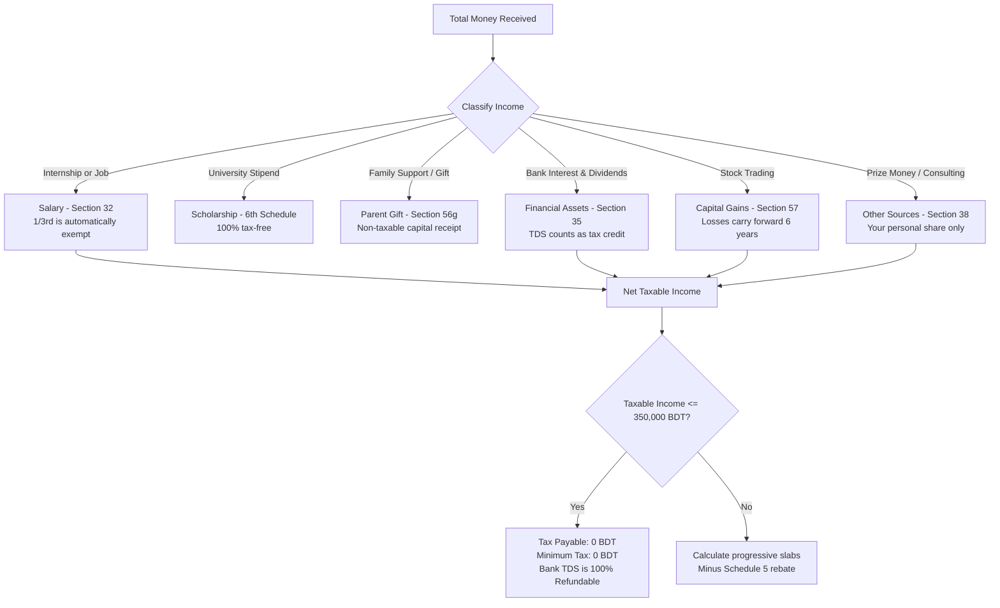
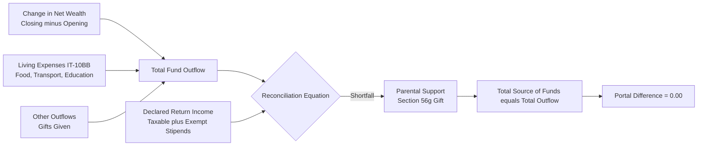

# Bangladesh Youth Tax Calculator (`youth-tax-calculator`)

A tax calculator and filing assistant for Bangladeshi students, interns, fresh graduates, and first-time employees filing on the NBR e-Return portal (etaxnbr.gov.bd).

---

## Table of Contents
- [TL;DR](#tldr)
- [How It Works (Visual Guide)](#how-it-works-visual-guide)
  - [1. Income Flow and Tax Calculation](#1-income-flow-and-tax-calculation)
  - [2. The Zero-Difference Balance Sheet](#2-the-zero-difference-balance-sheet)
- [How to Use](#how-to-use)
  - [Method 1: Interactive Terminal Wizard](#method-1-interactive-terminal-wizard)
  - [Method 2: One-Line CLI Flags](#method-2-one-line-cli-flags)
  - [Method 3: As an AI Agent Skill](#method-3-as-an-ai-agent-skill)
- [Technical Details and Architecture](#technical-details-and-architecture)
  - [Statutory Rules (Income Tax Act 2023)](#statutory-rules-income-tax-act-2023)
  - [Why We Use Deterministic Python](#why-we-use-deterministic-python)
  - [Portal UI Traps and How We Handle Them](#portal-ui-traps-and-how-we-handle-them)
- [Project Structure](#project-structure)
- [License and Disclaimer](#license-and-disclaimer)

---

## TL;DR

If you are a student, intern, or fresh graduate in Bangladesh, your tax return on `etaxnbr.gov.bd` should almost always result in **0 BDT tax payable**, and any bank source tax (TDS) deducted should be **refunded to you**.

This project provides two things:
1. **A standalone Python engine (`calculator.py`):** Calculates your exact numbers, applies statutory deductions, and solves the balance sheet formula so your portal form has a difference of exactly 0.00.
2. **An AI Skill / Assistant:** Guides you screen-by-screen through the NBR portal, warns you about hidden buttons, and gives you the exact legal section for every number you enter.

---

## How It Works (Visual Guide)

### 1. Income Flow and Tax Calculation

Here is how different types of money you receive are treated under the Income Tax Act 2023:



### 2. The Zero-Difference Balance Sheet

On the NBR portal, you cannot submit Form IT-10B unless `Difference = 0`. The calculator solves this using basic balance sheet math:



---

## How to Use

### Method 1: Interactive Terminal Wizard

No coding knowledge required. Open PowerShell or Terminal and run:

```bash
python calculator.py
```

It will ask you a series of questions:
* Your name, category, and city location
* Gross salary or internship stipends
* University scholarships
* Bank interest and bank TDS
* Stock gains or losses
* Approximate living expenses (food, transport, education)
* Opening wealth from last year (enter 0 if first time)

When finished, it prints a clean breakdown table and tells you the exact number to enter under **Other Receipts** so your portal shows `Difference = 0.00`.

### Method 2: One-Line CLI Flags

If you already know your figures, you can pass them directly:

```bash
python calculator.py --salary 35000 --stipend 18000 --interest 228 --bank-tds 31 --bank-balance 34908 --capital-gain 896 --capital-loss 3924 --mutual-funds 28956 --expenses 170000 --opening-wealth 56759
```

Add `--output-json` to get raw JSON for scripts or APIs.

### Method 3: As an AI Agent Skill

If you use Antigravity, Claude Code, Cursor, or ChatGPT, you can install this skill globally so your AI assistant knows Bangladesh tax law automatically.

#### One-Click Install:
* **Windows (PowerShell):**
  ```powershell
  .\install.ps1
  ```
* **macOS / Linux (Bash):**
  ```bash
  chmod +x install.sh && ./install.sh
  ```

Once installed, simply ask your AI:
* *"I am a university student in Bangladesh with an internship, walk me through my tax return on etaxnbr.gov.bd"*
* *"Calculate my parental support figure so my IT-10B difference is 0.00"*

---

## Technical Details and Architecture

### Statutory Rules (Income Tax Act 2023)

1. **Section 32 (Employment):** You get an automatic deduction of one-third of your salary (or 4,50,000 BDT, whichever is less). You do not pay tax on this portion.
2. **Sixth Schedule, Part 1, Paragraph 8 (Stipends):** Any stipend or scholarship to meet the cost of education is 100% tax-free.
3. **Section 56(g) (Family Support):** Money received from parents, spouse, or children is not income. It is a non-taxable capital receipt. It is declared in Form IT-10B under Source of Fund to explain where your money came from.
4. **Section 70 (Capital Losses):** Losses from stock trading cannot reduce your salary tax. They are ring-fenced and carried forward for up to 6 consecutive years.
5. **Section 163 (Minimum Tax):** Minimum tax (5,000 BDT in City Corporations) **never triggers** if your taxable income is equal to or less than 3,50,000 BDT. If you earn under the limit, your tax is strictly 0 BDT.

### Why We Use Deterministic Python

Language models (including Claude and GPT-4) are good at explaining laws, but they can make small arithmetic mistakes when adding up multi-line balance sheets. 

To prevent this:
* All calculations (slabs, exemptions, rebates, and balance sheet reconciliation) run inside `calculator.py`.
* The AI runs the script, gets exact numbers, and quotes them to you with the relevant section of the law.

### Portal UI Traps and How We Handle Them

The NBR portal (`etaxnbr.gov.bd`) has a few quirks that confuse first-time filers:
1. **The Hidden Exemption Tab:** On Screen 1, you must select "Yes" for "Any income which is fully exempted from tax?". If you leave it as "No", the portal completely hides the tab where you declare student stipends.
2. **The Green Checkmark (✓):** In Capital Gains and Financial Assets dropdowns, selecting an item shows a small green tick button next to it. You must click that tick mark, or the input fields will not appear on screen.
3. **The Section 70 PDF Glitch:** On the final 14-page PDF return, Line 7 Gross Wealth will look smaller than Line 10 Total Assets by the exact amount of your carried-forward stock loss. This is a known reporting artifact in NBR's software, not an error on your part.

---

## Project Structure

```text
youth-tax-calculator/
├── calculator.py                                      # Standalone Python tax engine
├── install.ps1                                        # 1-click installer for Windows
├── install.sh                                         # 1-click installer for macOS/Linux
├── README.md                                          # This guide
└── skills/youth-tax-calculator/
    ├── SKILL.md                                       # Full AI prompt & agent protocol
    └── references/
        ├── 01_getting_started_and_registration.md     # e-TIN & portal login
        ├── 02_assessment_and_income_heads.md          # Salaries, capital gains, stipends
        ├── 03_rebate_and_living_expenses.md           # Schedule 5 & IT-10BB
        ├── 04_assets_and_liabilities_it10b.md         # Balance sheet & zero-difference math
        ├── 05_tax_computation_and_payment.md         # Slabs, rebates & minimum tax rules
        ├── 06_return_submission_and_tax_records.md    # OTP submission & PSR download
        ├── 07_statutory_tax_law_codex.md             # Complete legal analysis of ITA 2023
        ├── Special_Registration.pdf                   # Official guide for overseas citizens
        └── UserManualEN.pdf                           # Official 107-page NBR User Manual
```

---

## License and Disclaimer

This project is licensed under the **MIT License**.

**Disclaimer:** This tool is for educational, informational, and self-filing assistance based on the Income Tax Act 2023 and official NBR publications. The creators are not licensed tax lawyers or chartered accountants. Verify all numbers before final OTP submission on `etaxnbr.gov.bd`.
