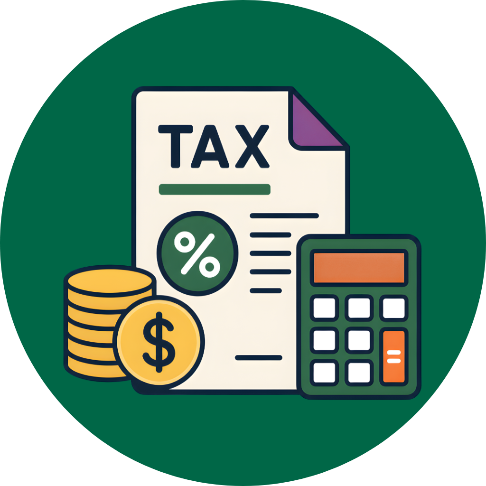
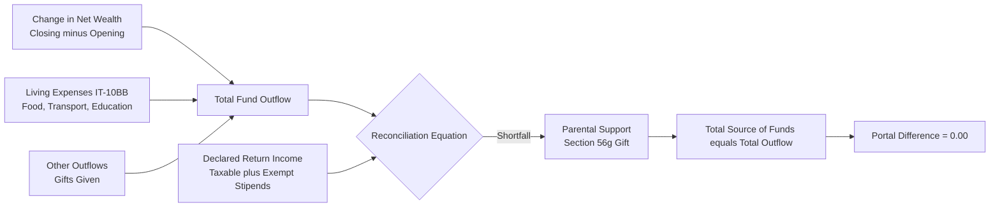

<p align="center">
  
</p>

# Bangladesh Youth Tax Calculator (`youth-tax-calculator`)

A tax calculator and filing assistant made for Bangladeshi students, interns, fresh graduates, and first-time employees filing on the NBR e-Return portal (etaxnbr.gov.bd).

---

## Table of Contents

| Jump To | What It Covers |
| :--- | :--- |
| [TL;DR](#tldr) | Fast summary: keep tax at minimum, TDS refund, zero difference |
| [Visual Guide & Flowcharts](#how-it-works-visual-guide) | Flowcharts for income flow and balance sheet math |
| [How to Use](#how-to-use) | AI Skill (Primary), interactive wizard, and CLI flags |
| [For LLMs and Web Crawlers](#for-llms-and-web-crawlers) | Direct context endpoints and llms.txt standard |
| [Technical Details and Architecture](#technical-details-and-architecture) | Income Tax Act 2023 rules and portal quirks |
| [Project Structure](#project-structure) | Repository layout, context files, and guides |
| [License and Disclaimer](#license-and-disclaimer) | Legal disclaimer and MIT license |

---

## TL;DR

If you are a student, intern, or fresh graduate in Bangladesh, this project helps you **keep tax expense at minimum**, claim all eligible statutory exemptions (often resulting in **0 BDT tax payable** for qualifying incomes), and get any bank source tax (TDS) deducted **refunded to you**.

This project is an **AI Agent Skill first**, backed by a deterministic Python engine:
1. **The AI Skill (`skills/youth-tax-calculator`):** The primary brain. You give your AI assistant the rules, laws, and screen-by-screen guidance so it can guide you through every screen of `etaxnbr.gov.bd` with zero hallucinations.
2. **The Python Engine (`calculator.py`):** An added tool that the AI (or you) runs to solve the exact arithmetic and balance sheet math.

---

## How It Works (Visual Guide)

### 1. Income Flow and Tax Calculation

Here is how different types of money you receive are treated under the Income Tax Act 2023:


### 2. The Zero-Difference Balance Sheet

On the NBR portal, you cannot submit Form IT-10B unless `Difference = 0`. The calculator solves this using basic balance sheet math:



---

## How to Use

### Method 1: As an AI Agent Skill (Recommended)

This project is built primarily as an AI Agent Skill. LLMs are good at explaining legal sections, but they can make silly arithmetic mistakes when adding up multi-line balance sheets. 

By installing this skill, your AI gets the complete screen-by-screen e-Return playbook, cites the Income Tax Act 2023 for every line, and calls the Python engine behind the scenes to do the math.

#### One-Click Install:
* **Windows (PowerShell):**
  ```powershell
  .\install.ps1
  ```
* **macOS / Linux (Bash):**
  ```bash
  chmod +x install.sh && ./install.sh
  ```
* **Autonomous AI Agents (Claude Code / Cursor / Terminal):**
  ```bash
  curl -s https://raw.githubusercontent.com/zaifears/youth-tax-calculator/main/llms-full.txt > tax_skill.md
  ```

Once installed, simply ask your AI:
* "I am a university student in Bangladesh with an internship, walk me through my tax return on etaxnbr.gov.bd"
* "Calculate my parental support figure so my IT-10B difference is 0.00"

### Method 2: Interactive Terminal Wizard

If you prefer not using an AI assistant and just want to crunch the numbers yourself, run the standalone Python wizard:

```bash
python calculator.py
```

It will ask you a series of simple questions:
* Your name, category, and city location
* Gross salary or internship stipends
* University scholarships
* Bank interest and bank TDS
* Stock gains or losses
* Approximate living expenses (food, transport, education)
* Opening wealth from last year (enter 0 if first time)

When finished, it prints a clean breakdown table and tells you the exact number to enter under **Other Receipts** so your portal shows `Difference = 0.00`.

### Method 3: One-Line CLI Flags

If you already know your figures, you can pass them directly via command line flags:

```bash
python calculator.py --salary 35000 --stipend 18000 --interest 228 --bank-tds 31 --bank-balance 34908 --capital-gain 896 --capital-loss 3924 --mutual-funds 28956 --expenses 170000 --opening-wealth 56759
```

Add `--output-json` to get raw JSON for scripts or APIs.

---

## For LLMs and Web Crawlers

This repository is optimized for autonomous coding agents, LLMs, and legal search crawlers (Claude, Cursor, Copilot, ChatGPT, Gemini, Perplexity).

### Machine-Readable Endpoints

* **`/llms.txt`**: Standard manifest following the [llmstxt.org](https://llmstxt.org) specification. Contains project rules, file paths, and quick commands.
* **`/llms-full.txt`**: Complete single-file context bundle containing the skill prompt, statutory tax law codex, balance sheet math, and CLI docs. Ideal for one-shot ingestion without crawling multiple files.

### How to Feed This Repo to Your AI

* **In Cursor:** Add `https://raw.githubusercontent.com/zaifears/youth-tax-calculator/main/llms.txt` to your `@Docs` index.
* **In Claude Code or CLI Agents:** Run:
  ```bash
  curl -s https://raw.githubusercontent.com/zaifears/youth-tax-calculator/main/llms-full.txt > tax_context.md
  ```
* **In Web LLMs (ChatGPT / Claude / Gemini):** Paste the raw link to `SKILL.md`:
  `https://raw.githubusercontent.com/zaifears/youth-tax-calculator/main/skills/youth-tax-calculator/SKILL.md`

---

## Technical Details and Architecture

### Statutory Rules (Income Tax Act 2023)

1. **Section 32 (Employment):** You get an automatic deduction of one-third of your salary (or 4,50,000 BDT, whichever is less). You do not pay tax on this portion.
2. **Sixth Schedule, Part 1, Paragraph 8 (Stipends):** Any stipend or scholarship to meet the cost of education is 100% tax-free.
3. **Section 56(g) (Family Support):** Money received from parents, spouse, or children is not income. It is a non-taxable capital receipt. It is declared in Form IT-10B under Source of Fund to explain where your money came from.
4. **Section 70 (Capital Losses):** Losses from stock trading cannot reduce your salary tax. They are ring-fenced and carried forward for up to 6 consecutive years.
5. **Section 163 (Minimum Tax):** Minimum tax (5,000 BDT in City Corporations) **never triggers** if your taxable income is equal to or less than 400,000 BDT (450,000 BDT for women and senior citizens). If you earn under the limit, your tax is strictly 0 BDT.

### Why We Use Deterministic Python

Language models are good at explaining laws, but they can make small arithmetic mistakes when adding up multi-line balance sheets. 

To prevent this:
* All calculations (slabs, exemptions, rebates, and balance sheet reconciliation) run inside `calculator.py`.
* The AI runs the script, gets exact numbers, and quotes them to you with the relevant section of the law.

---

## Project Structure

```text
youth-tax-calculator/
├── calculator.py                                      # Standalone Python tax engine
├── install.ps1                                        # 1-click installer for Windows
├── install.sh                                         # 1-click installer for macOS/Linux
├── llms.txt                                           # Machine-readable standard index for LLMs
├── llms-full.txt                                      # Single-file bundled context for AI crawlers
├── README.md                                          # This guide
└── skills/youth-tax-calculator/
    ├── SKILL.md                                       # Full AI prompt and agent protocol
    └── references/
        ├── 01_getting_started_and_registration.md     # e-TIN and portal login
        ├── 02_assessment_and_income_heads.md          # Salaries, capital gains, stipends
        ├── 03_rebate_and_living_expenses.md           # Schedule 5 and IT-10BB
        ├── 04_assets_and_liabilities_it10b.md         # Balance sheet and zero-difference math
        ├── 05_tax_computation_and_payment.md         # Slabs, rebates and minimum tax rules
        ├── 06_return_submission_and_tax_records.md    # OTP submission and PSR download
        ├── 07_statutory_tax_law_codex.md             # Complete legal analysis of ITA 2023
        ├── Special_Registration.pdf                   # Official guide for overseas citizens
        └── UserManualEN.pdf                           # Official 107-page NBR User Manual
```

---

## License and Disclaimer

This project is licensed under the **MIT License**.

**Disclaimer:** This tool is for educational, informational, and self-filing assistance based on the Income Tax Act 2023 and official NBR publications. The creators are not licensed tax lawyers or chartered accountants. Verify all numbers before final OTP submission on `etaxnbr.gov.bd`.
